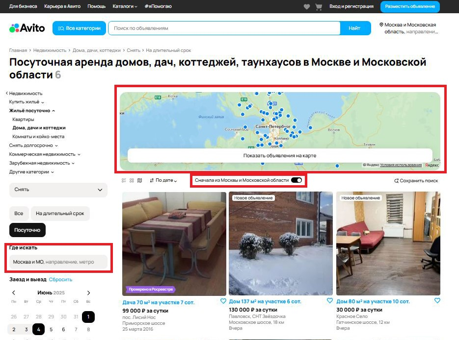

### Шаги воспроизведения:
1. Перейти по ссылке https://www.avito.ru/
2. Выбрать категорию "Недвижимость" -> "Дома, дачи, коттеджи" -> "Снять" -> "Посуточно" -> "Москва и Московская область"
   -> дата "1.06-4.06".
3. В боковом меню выбрать фильтры "3 гостя", "без залога", "5 минут пешком до метро", "можно с животными".
4. Выбрать сортировку "по дате", "показывать на карте" и "сначала из Москвы и Московской области".
5. Нажать на кнопку "Показать ... объявлений".

## При наличии багов 3, 4, 5 дальнейшее тестирование не будет возможно. Так как критически важный пользовательский путь не пройден.

### Шаги воспроизведения аналогичны для всех багов

## 1. Некорректное наименование кнопки "Найти"

Описание: В интерфейсе кнопка "Найти" указана как "Найт".

Приоритет: medium (опечатка на самом видном месте может негативно повлиять на мнение пользователя)

Ожидаемый результат: Наименование кнопки "Найти"

Фактический результат: Наименование кнопки "Найт"

## 2. Неверный путь в элементе "хлебные крошки"

Описание: В элементе "хлебные крошки" неверно указана категория "Посуточно".

Приоритет:
low (в элементе не отображается категория "посуточно", но пользователю отображаются верные результаты поиска)

Ожидаемый результат:
"Хлебные крошки" выглядят следующим образом:
Главная > Недвижимость > Дома, дачи, коттеджи > Снять > Посуточно

Фактический результат:
"Хлебные крошки" выглядят следующим образом:
Главная > Недвижимость > Дома, дачи, коттеджи > Снять > На длительный срок

## 3. Отображение карты вне Москвы и Московской области при выбранной области поиска и switch-элемента

Описание: Карта отображает объекты из Санкт-Петербурга и Ленинградской области, несмотря на установленный регион
"Москва и Московская область" и switch "сначала из Москвы и Московской области".

Приоритет: high (пользователь просматривает объявления, которые не соответствуют его ожиданиям)

Ожидаемый результат: Карта отображает только объекты в Москве и Московской области

Фактический результат: Карта показывает объекты в Санкт-Петербурге и Ленинградской области

## 4. При выборе radio button "Карта с товарами" отображаются товары в виде плиток
Описание: При переключении на "Карта с товарами" вместо карты остаются карточки товаров.

Приоритет: high (у пользователя нет наглядного просмотра товара на географической карте)

Ожидаемый результат: Отображение карты выбранной локации с товарами

Фактический результат: Отображаются товары в виде плиток

## 5. Сообщение о том, что ничего не найдено при поиске

Описание: При поиске ничего не найдено, но объявления отображаются.

Приоритет: high(пользователь ожидает увидеть сообщение только о том, что ничего не нашлось)

Ожидаемый результат: Сообщение о том, что при поиске ничего не нашлось, других объявлений нет

Фактический результат: При поиске ничего не нашлось, но объявления отображаются

## 6. При выборе фильтра "площадь участка" некорректное отображение надписи "до"

Описание: Опечатка в фильтре "площадь участка"

Приоритет: low(опечатка, которую может не заметить пользователь)

Ожидаемый результат: Надпись "до"

Фактический результат: Надпись "да"

## 7. Разное количество объявлений в заголовке и результатах выдачи

Описание: Количество объявлений в заголовке отличается от количества объявлений в результатах поиска

Приоритет: low(пользователь ожидает увидеть меньше объявлений, чем есть в заголовке и в результатах поиска)

Ожидаемый результат: Количество объявлений в заголовке (6) такое же, как и в результатах поиска (6)

Фактический результат: Количество объявлений в заголовке (6) отличается от количества объявлений в результатах поиска (9)

## 8. Кнопка "показать объявления" отображается как "ничего не нашлось"

Описание: После выбранных фильтров кнопка "показать объявления" отображается как "ничего не найдено", при этом объявления отображаются

Приоритет: high(пользователь видит совсем не подходящие объявления с сообщением о том, что ничего не найдено)

Ожидаемый результат: Ничего не найдено

Фактический результат: Ничего не найдено, но объявления отображаются

## 9. Некорректное отображение пагинации в результатах поиска

Описание: Количество страниц в пагинации рассчитывается некорректно (отображается 4 страницы вместо ожидаемой 1)

Приоритет: medium(пользователь ожидает увидеть 1 страницу)

Ожидаемый результат: Пагинация внизу страницы рассчитывается корректно, то есть 1 страница

Фактический результат: Пагинация 4 страницы

## 10. Сортировка "по дате" не выполняется

Описание: Сортировка "по дате" не сортирует объявления по назначенному фильтру

Приоритет: high(пользователь ожидает увидеть самые ранние объявления)

Ожидаемый результат: Сортировка "по дате" сортирует объявления по назначенному фильтру

Фактический результат: Сортировка "по дате" не сортирует объявления, самое ранне объявление от 25 марта 2016 года

## 11. В фильтре "правила" выбранный чекбокс "можно с животными" не возвращается на первое место при его выборе

Описание: При выборе чекбокса "можно с животными" в фильтре "правила" не возвращается на первое место

Приоритет: low(незаметно для пользователя)

Ожидаемый результат: При выборе чекбокса "можно с животными" в фильтре "правила" возвращается на первое место

Фактический результат: При выборе чекбокса "можно с животными" в фильтре "правила" не возвращается на первое место

## 12. При выбранном фильтре "посуточно" отображается объявление с ценой аренды за месяц

Описание: При выбранном фильтре "посуточно" отображается таунхаус с ценой аренды за месяц

Приоритет: medium(вводит в заблуждение пользователя)

Ожидаемый результат: При выбранном фильтре "посуточно" не отображается объявление "таунхаус 150 квадратных метров на
участке 1 сот." с ценой аренды за месяц

Фактический результат: При выбранном фильтре "посуточно" отображается объявление "таунхаус 150 квадратных метров на 
участке 1 сот." с ценой аренды за месяц

## 13. При выбранном фильтре "цена за сутки" отображаются объявления больше указанного диапазона

Описание: При выбранном фильтре "цена за сутки" до 50 тыс. рублей отображаются объявления больше указанного диапазона

Приоритет: high(пользователь ожидает увидеть объявления в указанном диапазоне)

Ожидаемый результат: Фильтр "цена за сутки" отбирает объявления в указанном диапазоне до 50 тыс. рублей

Фактический результат: Фильтр "цена за сутки" отбирает объявления больше указанного диапазона, чем 50 тыс. рублей,
в результате отображаются объявления с ценой за сутки 99 тыс. рублей, 130 тыс. рублей, 80 тыс. рублей, что не 
соответствует фильтру

## 14. Метка "проверено в Росреестре" у объявления, которое сдается в аренду

Описание: Метка "проверено в Росреестре" отображается у объявления (дача 70 квадратных метро на участке 7 сот.), 
которое сдается в аренду, но эта метка относится только к продающейся недвижимости

Приоритет: low(пользователь может об этом не знать)

Ожидаемый результат: Метка "проверено в Росреестре" не отображается у объявления "Дача 70 квадратных метро на участке 
7 сот."

Фактический результат: Метка "проверено в Росреестре" отображается у объявления "Дача 70 квадратных метро на участке 
7 сот."

## 15. Метка "14 дней на возврат" отображается у объявления, которое сдается в аренду

Описание: Метка "14 дней на возврат" отображается у объявления (таунхаус 150 квадратных метров на участке 1 сот.),
которое сдается в аренду, но эта метка относится только к товарам 

Приоритет: medium(метка применяется только к товарам при их покупке, а не к недвижимости, может ввести пользователя в недоумение)

Ожидаемый результат: Метка "14 дней на возврат" не отображается у объявления (таунхаус 150 квадратных метров на участке 
1 сот.), которое сдается в аренду

Фактический результат: Метка "14 дней на возврат" отображается у объявления (таунхаус 150 квадратных метров на участке
1 сот.), которое сдается в аренду

## 16. Отсутствие метки "новое объявление"

Описание: Метка "новое объявление" не отображается у объявления, которое вышло 4 часа назад

Приоритет: low(не критично для пользователя при поиске объявления)

Ожидаемый результат: Метка "новое объявление" отображается у объявления (таунхаус 150 квадратных метров на участке 
1 сот.), которое вышло 4 часа назад

Фактический результат: Метка "новое объявление" не отображается у объявления (таунхаус 150 квадратных метров на участке 
1 сот.), которое вышло 4 часа назад

## 17. Бонусы бронирования указаны не у всех объявлений при посуточной аренде 

Описание: Бонусы бронирования указаны не у всех объявлений при посуточной аренде

Приоритет: low(бонусы бронирования не критичны для пользователя при поиске объявления)

Ожидаемый результат: Бонусы бронирования указаны у всех объявлений при посуточной аренде

Фактический результат: Бонусы бронирования указаны не у всех объявлений при посуточной аренде

## 18. Сумма за весь период снятия рассчитывается не для всех объявлений при посуточной аренде

Описание: Сумма за весь период снятия рассчитывается не для всех объявлений при посуточной аренде

Приоритет: low(при оплате аренды сумма за весь период будет видна пользователю, финансовых рисков не будет)

Ожидаемый результат: Сумма за весь период снятия рассчитывается для всех объявлений при посуточной аренде

Фактический результат: Сумма не рассчитывается за весь период аренды

## 19. У объявления о сдаче дома указанна доставка

Описание: У объявления 2-к. дом 45 квадратных метров есть возможность доставки от 1 дня

Приоритет: low(опечатка, т.к. доставка применима только к домам при покупке)

Ожидаемый результат: У объявления с арендой недвижимости нет доставки

Фактический результат: У объявления 2-к. дом 45 квадратных метров есть возможность доставки от 1 дня

## 20. У объявления указана стоимость без учета временного периода аренды

Описание: У объявления 2-к. дом 45 квадратных метров указана стоимость без обозначения за сутки, за месяц или другой 
промежуток времени

Приоритет: high(критично при поиске объявления, за которое пользователь платит деньги)

Ожидаемый результат: У объявления 2-к. дом 45 квадратных метров указана стоимость за сутки, за месяц или другой 
промежуток времени

Фактический результат: У объявления 2-к. дом 45 квадратных метров просто указана стоимость 27 700 рублей.

## 21. Неверный расчет стоимости аренды за выбранный период

Описание: Расчет стоимости аренды за выбранный период некорректен

Приоритет: high(некорректная стоимость указанного периода аренды, может повлечь непредвиденные расходы бизнеса)

Ожидаемый результат: Расчет стоимости аренды за выбранный период корректен, у 2-к. дом 45 квадратных метров стоимость 
за 1 день 27 700 рублей, за выбранный период стоимость 83100 рублей, у 5-к. дом 300 квадратных метров стоимость за 1 
день 21667 рублей, за выбранный период стоимость 65001 рублей, у 5-к. дом 200 квадратных метров стоимость за 1 день 
8334 рублей, за выбранный период стоимость 25002 рублей

Фактический результат: Расчет стоимости аренды за выбранный период некорректен, у 2-к. дом 45 квадратных метров стоимость
за выбранный период 11970 рублей, у 5-к. дом 300 квадратных метров стоимость за выбранный период 65000 рублей, у 5-к. 
дом 200 квадратных метров стоимость за выбранный период 25000 рублей

## 22. Ошибка модерации изображения 

Описание: Изображения к объявлениям "5-к. дом 300 квадратных метров" и "Дом мечты. Де Агостини" прошли модерацию, 
но изображения не соответствует требованиям объявления

Приоритет: medium(может повлиять на мнение пользователя о сервисе, т.к. в одном случае он видит рекламу окон, а в 
другом игрушечный дом)

Ожидаемый результат: Изображения к объявлениям "5-к. дом 300 квадратных метров" и "Дом мечты. Де Агостини" не прошли 
модерацию и не были допущены к публикации

Фактический результат: Изображения к объявлениям "5-к. дом 300 квадратных метров" и "Дом мечты. Де Агостини" прошли 
модерацию и были допущены к публикации

## 23. Некорректная выдача при фильтре "пешком до метро"

Описание: Фильтр "пешком до метро" работает некорректно, показывая объявления, которые находятся в отдаленности от метро

Приоритет: high(выданная информация не соответствует запросу пользователя)

Ожидаемый результат: Фильтр "пешком до метро" не показывает объявления, которые находятся в отдаленности от метро

Фактический результат: Фильтр "пешком до метро" работает некорректно, показывая объявления, которые находятся в 
отдаленности от метро, в поселках, в селах, в деревнях

## 24. Нерелевантные объявления в категории "вас может заинтересовать"

Описание: Объявления в категории "вас может заинтересовать" не соответствуют запросу пользователя, кроме цены за сутки

Приоритет: medium(второстепенное объявление)

Ожидаемый результат: Объявления в категории "вас может заинтересовать" отображаются те, которые частично подходят
запросам пользователя

Фактический результат: Объявления в категории "вас может заинтересовать" не соответствуют запросу пользователя

